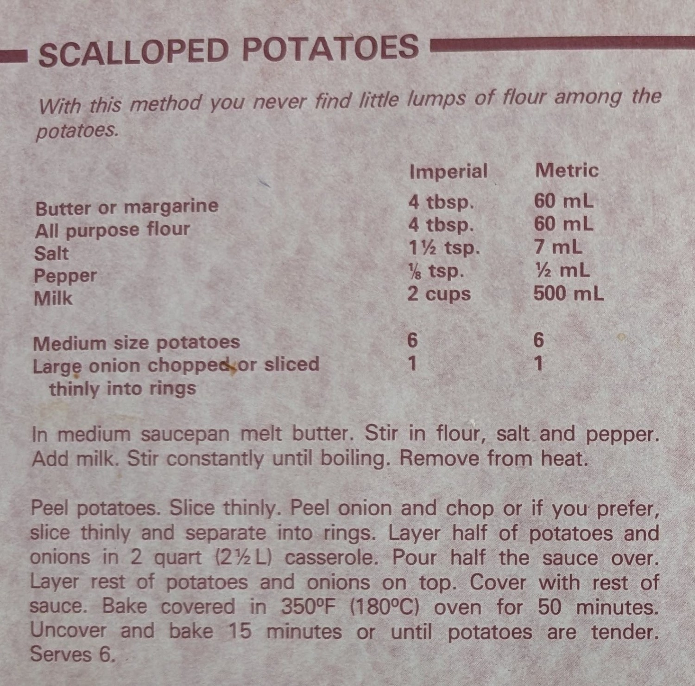

# Ingredients

Serves 6.

| Ingredient           | Quantity          |
| -------------------- | ----------------- |
| Butter               | 4tbsp. / 60mL     |
| All Purpose Flour    | 4tbsp. / 60mL     |
| Salt                 | 1 1/2 tsp. / 7mL  |
| Pepper               | 1/8 tsp. / 1/2 mL |
| Milk                 | 2 cups / 500mL    |
| Medium Size Potatoes | 6                 |
| Large Onion          | 1                 |

# Directions

1. PREHEAT THE OVEN to 350F

## Sauce

1. Melt butter in a saucepan.
2. Stir in flour, salt, and pepper.
3. Add milk.
4. Stir until boiling.
5. Once boiling, remove from heat.

## Bake

1. Peel potatoes if thick skinned.
2. Slice thinly and evenly. Thick slices won't cook all the way.
3. Peep and chop an onion. Again, thin slices.
4. Layer half of the potatoes and onions. Pour half of the sauce over.
5. Layer the other half, and place the rest of the sauce on top.
6. Cover the dish with aluminum foil.
7. Bake at 350F for 50 minutes.
8. Uncover and bake for 15 minutes or until potatoes are fork tender.

# Notes

- Each time I've made this, I've thought it wouldn't be enough sauce, and made extra. For a normal size casserole dish, I would do 50% more of all the quantities. Lay out enough potatoes to fill the dish to get an estimate of how many you'll use, and then adjust the sauce recipe to match. As you're laying it out though, it won't look like enough sauce.
  - I will say though, based on the number of potatoes, the quantity is probably about right. As far as a medium size potato goes, I would say those are just normal potatoes. If you use russets, Those should probably count as 2 each.
- Definitely use way more pepper than you would expect. Remember you can taste the sauce as you're making it and season to taste. It should taste a bit stronger than you expect; it has to have enough reading for itself and the unseasoned potatoes.
- REALLY make sure you chop the potatoes thinly and evenly. I would say chop them thinner than you expect, and err on the side of too thin rather than too thick. Any slices that are too thick won't cook well in the time it spends in the oven.
- For the onions, also make sure to slice them thinner than you expect. It would probably be easier to just dice them, but to keep the vibes of the sliced onions just make sure you don't leave any big pieces in there. You can always dice those up before putting them in.
- At the end of cooking, you can also throw the potatoes under the broiler for a moment to crisp up the top layer a bit more, if you so desire.

## Modifications

- You can use these scalloped potatoes in place of the mashed potatoes in a shepherd's pie, and while it may seem sacrilegious it works quite well. Simply follow the recipe normally, and after the initial 50 minute bake, instead of baking again uncovered, place the potatoes on top of the beef (made whichever way you want), and bake the whole thing. Putting the potatoes under the broiler here works particularly well I think.

# Original Recipe

