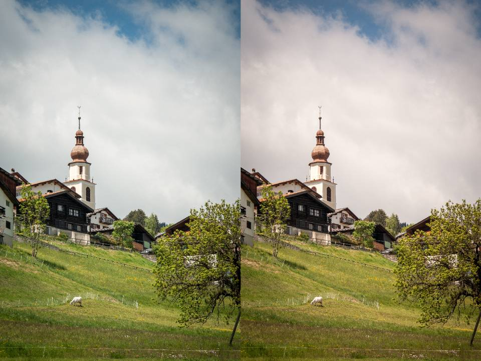

Digital cameras have a feature called auto white balance which I feel is a rather apt metaphor for much of how our brains work.

Auto white balance is a feature that attempts to neutralize the colours in an image to prevent any sort of strong colour cast. Take the follow image I shot in Switzerland as an example:

_Left: Daylight (5500K). Right: Auto (6100K). The image on the left appears closer to how it looked in person._

The image as shot has a bit of a cool blue/green cast, while when corrected with auto white balance the image becomes a lot warmer to neutralize the colours overall. Personally, I find the left image to be much more pleasing to the eye, and it also happens to look much closer to my memory of it when I shot the image.

Auto white balance is particularly useful when balancing skin tones, as humans tend to be very sensitive to skin tones that look off.

_Left: Daylight (5500K). Right: Auto (4200K). Also note that the tint (green/magenta) is different between the two images, not just the colour temperature._

In this case I find the auto image to be more pleasing to look at as I feel it more correctly captures my skin tones. It also is a closer match to my memory, but part of that is that our brains also perform a form of auto white balance with our vision.

Imagine for a moment you are in a hotel room with some warm lighting. After being in the room for a while, you likely won't get the impression that everything looks really warm, rather everything would just look normal. Now imagine that suddenly all the lights shift to an intense green. Everything would look _extremely_ green for a while, but after a bit your eyes adjust and while everything does still appear green, you can still discern colours like you would normally, for the most part. Now change the lights back to a more typical warm lighting, and everything appears extremely magenta, as your brain has been colour-correcting internally and it takes a moment for it to stop doing so and return to normal.

This effect of the way our brains process our vision is a good thing overall, I think. I suspect this effect is a way of enhancing our vision in extreme lighting situations by making the appearance of the environment match how we expect it to look regardless of the actual lighting conditions. I think the interesting thing to note here however is that this is an example of the way that our perceptions are warped by the processing our brains do, and that the way we perceive the environment doesn't necessarily have everything to do with how that environment actually appears.

The interesting thing to note about this effect is that I feel it happens with just about everything our brains experience, not just our vision. In particular I feel as though this happens with one's mental state. If you're depressed, to a certain extent your brain will attempt to correct its feelings on itself so as to make them feel "normal". Over long periods of time in this state I've found that this effect makes it difficult to properly ascertain how exactly it is I'm feeling, since for the majority of that time I'm just feeling "normal", even though this normal is actually bad relative to what a healthy mental state might look like.

For me I find this to be the reason why I find writing my own thoughts to be so important. When you take the ideas and feelings that are floating around in your head and put them to words on a page, they become crystalized and separate from you in a way that lets you evaluate them more objectively. They become less subject to the auto white balance that your brain applies to all of your thoughts and more like the experiences of someone else, which makes them much easier to process.

In general this neutralizing effect our brains have on our experiences is one I try to be aware of when experiencing things in the long term. Things experienced regularly that were once really good move towards a more neutral feeling, and similar for things that feel bad. Looking backwards and reviewing your thoughts on your past experiences and your mental state I feel is the single most valuable thing that can be done to counteract this effect.
